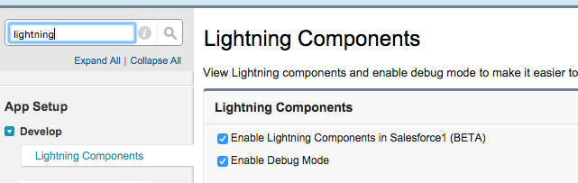
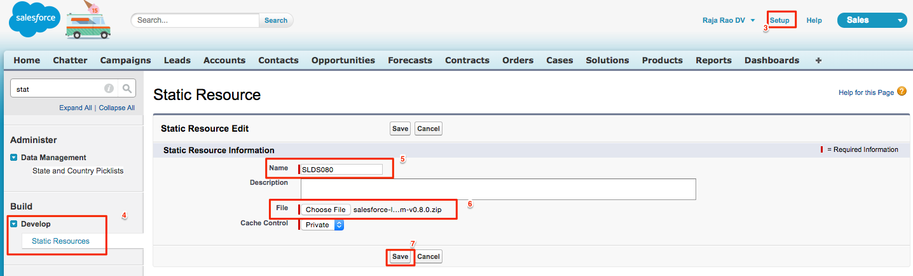

##Introduction
In this project you'll learn how to use the <a href="https://www.lightningdesignsystem.com" target="_blank">Salesforce Lightning Design System's (SLDS)</a> CSS framework in Lightning Components. Using SLDS in Lightning Components make your app look modern, responsive and also look very similar to Lightning Experience. 

You'll create an Accounts app that shows a list of accounts and a corresponding "Details" button. Along the way you'll learn how to create simple reusable Lightning Components like Buttons, use SVG icons, interact with the server to get a list of accounts and also pass data to a JavaScript controller when the button is clicked.

Here is what you final app will look like.

 
<image src="images/accountsListWithAccounidAlert.png" />

## Enable Lightning And Install the SLDS Framework

#### What You'll do

* You'll enable Lightning Components in your Developer Edition Org.
* Install Salesforce Lightning Design System (SLDS) as a static resource.

###Step 1 - Enable Lightning Components

1. Login to your Developer Edition Org.
2. Go to **Setup > Develop > Lightning Components**.
3. Check **Enable Lightning Components**.
4. Click **Save**.
5. (Press Yes in the warning dialog).

	

6. **Register My Domain (this step is only required if your org is on Winter '16)**
 
	Note: If your Org has the following logo on the top left corner of the browser, then it's on the Winter '16 release. 	
	
Please complete this step ONLY if you see this logo.

	In Winter '16 release, you need to enable 'My Domain' in order to build custom Lightning components. You can enable it by going through the following steps:	 
	
	6.1 Go to **Setup > Domain Management > My Domain**.
	
	6.2 Enter a unique domain name (some string) and check for availability.
	
	6.3 Agree to **Terms and Conditions**. 
	
	6.4 Press **Register**
	
	- You will get a notification when the registration is successful (It may take couple of minutes to 30 mins).
    - You then need to login with a new domain url, it may look like: **https://YOURDOMAIN-dev-ed.my.salesforce.com**
    
    6.5  Go back to **Setup > Domain Management > My Domain**.
    
    6.6 Press **Push to users** button.

    
    

###Step 2 - Install Lightning Design System As A Static Resource

1. Download version 0.8 of the SLDS CSS framework from <a href="https://www.lightningdesignsystem.com/resources/downloads#role=regular&status=all" target="_blank">here</a>.
3. In your Developer Edition, click on **Setup** on the top right.
4. Click on **Develop > Static Resources > New**.
5. Enter name as **SLDS080**.
6. Upload the zip file from the earlier step.
7. Click **Save**.

##Resources
* <a target="_blank" href="https://developer.salesforce.com/trailhead/module/lightning_design_system">Salesforce Design System Module</a>
* <a target="_blank" href="https://developer.salesforce.com/trailhead/module/lightning_components">Lightning Components Module</a>
