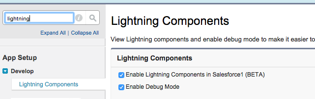
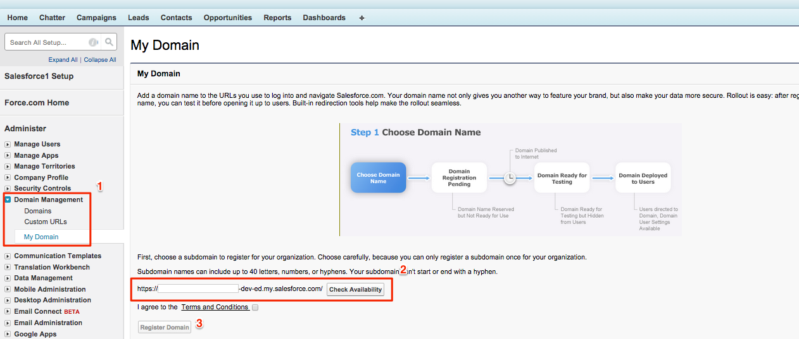
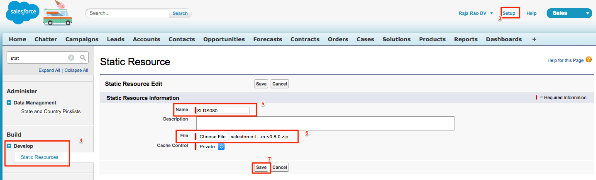

#Using SLDS In Lightning Components Tutorial

###Table Of Contents
<a href="#module-1-introduction">Module 1: Introduction</a>

<a href="#module-2-decompose-the-app-into-components">Module 2: Decompose The App Into Components</a>

<a href="#module-3-build-the-lightning-app">Module 3: Build the Lightning App</a>

<a href="#module-4-build-a-basic-svg-icon-component">Module 4: Build A Basic SVG Icon Component</a>

<a href="#module-5-build-a-button-component">Module 5: Build A Button Component</a>

<a href="#module-6-build-the-accountslist-component">Module 6: Build The AccountsList Component</a>

#Module 1: Introduction
In this project you'll learn how to use the <a href="https://www.lightningdesignsystem.com" target="_blank">Salesforce Lightning Design System's (SLDS)</a> CSS framework in Lightning Components. Using SLDS in Lightning Components make your app look modern, responsive and also look very similar to Lightning Experience. 

You'll create an Accounts app that shows a list of accounts and a corresponding "Details" button. Along the way you'll learn how to create simple reusable Lightning Components like Buttons, use SVG icons, interact with the server to get a list of accounts and also pass data to a JavaScript controller when the button is clicked.

Here is what you final app will look like.

 
<image src="images/accountsListWithAccounidAlert.png" />


## Enable Lightning And Install the SLDS Framework

#### What You'll do

* You'll enable Lightning Components in your Developer Edition Org.
* Install Salesforce Lightning Design System (SLDS) as a static resource.


###Step 1 - Enable Lightning Components

1. Login to your Developer Edition Org.
2. Go to **Setup > Develop > Lightning Components**.
3. Check **Enable Lightning Components**.
4. Click **Save**.
5. (Press Yes in the warning dialog).


	

6. **Register My Domain (this step is only required if your org is on Winter '16)**
 
	Note: If your Org has the following logo on the top left corner of the browser, then it's on the Winter '16 release. 	
	
Please complete this step ONLY if you see this logo.

	In Winter '16 release, you need to enable 'My Domain' in order to build custom Lightning components. You can enable it by going through the following steps:	 
	
	6.1 Go to **Setup > Domain Management > My Domain**.
	
	6.2 Enter a unique domain name (some string) and check for availability.
	
	6.3 Agree to **Terms and Conditions**. 
	
	6.4 Press **Register**
	
	- You will get a notification when the registration is successful (It may take couple of minutes to 30 mins).
    - You then need to login with a new domain url, it may look like: **https://YOURDOMAIN-dev-ed.my.salesforce.com**
    
    6.5  Go back to **Setup > Domain Management > My Domain**.
    
    6.6 Press **Push to users** button.

    
    
    > **Note:** It can take several minutes for the MyDomain feature to finish its provisioning process as it requires propagation of the new domain to Salesforce's DNS servers. You will be notified by email once the domain registration is complete. 

    > For more information about the MyDomain feature see the [online help](https://help.salesforce.com/HTViewHelpDoc?id=faq_domain_name_what.htm&language=en_US) in your org. 

###Step 2 - Install Lightning Design System As A Static Resource


1. Download version 0.8 of the SLDS CSS framework from <a href="https://www.lightningdesignsystem.com/resources/downloads#role=regular&status=all" target="_blank">here</a>.
3. In your Developer Edition, click on **Setup** on the top right.
4. Click on **Develop > Static Resources > New**.
5. Enter name as **SLDS080**.
6. Upload the zip file from the earlier step.
7. Click **Save**.



##Resources
* <a target="_blank" href="https://developer.salesforce.com/trailhead/module/lightning_design_system">Salesforce Design System Module</a>
* <a target="_blank" href="https://developer.salesforce.com/trailhead/module/lightning_components">Lightning Components Module</a>


#Module 2: Decompose The App Into Components
#### What You'll do

* Decompose the app into components.
* Learn the order in which to build the components.

##Step 1. Decompose The App
The first step of building an app in Lightning is to divide it into smaller components. In our app, we have the following components:

1. The App itself (it's also a component but with .app extension).
2. List Component.
3. Button Component.
4. Icon (SVG) Component.

<image src="images/allAccountsApp.png" />
##Step 2. Order Of Component Development
The general idea is to build a shell/dummy app that wraps all the components so that we can test other components inside it and then start building the smallest and the innermost components first and then build the outermost components later. 

We'll build components in the following order.

1. The App itself - This is the wrapper component.
2. Icon (SVG) Component - This is the innermost component.
3. Button Component.
4. List Component.


#Module 3: Build the Lightning App

#### What You'll do
* Build an **AllAccounts** Lightning App.
* Load the SLDS framework.


##Step 1. Build the Lightning App
First, we'll build our 'container' app that holds all the components. We'll also load the CSS from our static resource using the standard **ltng:require** component. Finally, we will create a **div** with CSS class **slds** to prevent the CSS of the SLDS framework from affecting other components.

1. Click on **{your name} > Developer Console** on the top right corner of your Developer Edition.
2. Click on **File > New > Lightning Application**.
3. Enter **AllAccounts** in the **Name** field.
4. Replace all the code with the one below

	```
	<aura:application>
		<ltng:require styles="/resource/slds080/assets/styles/salesforce-lightning-design-system-vf.css" />
		<div class="slds">
	 		//This is where components will live
		</div>	
	</aura:application>
	```
5. Click **Save**.

**Note:** This assumes that the SLDS CSS framework is loaded in a static resource named **SLDS080**

##Resources
* You can find open-source sample components <a href="https://github.com/ForceDotComLabs/sldsx" target="_blank">here</a>

#Module 4: Build A Basic SVG Icon Component
#### What You'll do

* Learn about SVG icons.
* Build a **svg** Lightning Component.

```
<svg aria-hidden="true" class="slds-icon slds-icon--small slds-icon-text-default">
    <use xlink:href="/assets/icons/utility-sprite/svg/symbols.svg#announcement"></use>
</svg>
```


SVG icons are vector based images that can scale irrespective of the display size without becoming pixelated. So a single svg image can be used in devices of various sizes and resolution. Hence they are highly desired. Lightning Design System uses them extensively for all the icons in the framework. 

However, the Lightning Components framework does not directly support SVG icons at this point. So we need to do some work to use them. Instead of doing this work everywhere we use SVG images, we'll build a component called **svg** that we can reuse everywhere.


##Step 1: Create Component Markup
The **svg** tag has 3 attributes: **(aria-hidden, class and xlink:href)** that can change. In this step we'll simply map all three to three corresponding Lightning Component attributes.


Let's create an **svg** component and map the attributes.

1. In Developer Console, Click on **New > Lightning Components**.
2. Enter **svg** as component name.
3. Click on **COMPONENT** tab on the right if it's not open.
4. Copy and paste the code below:

	```
	<aura:component>
	    <aura:attribute name="class" type="String" description="CSS classname for the SVG element" />
	    <aura:attribute name="xlinkHref" type="String" description="SLDS icon path. Ex: /assets/icons/utility-sprite/svg/symbols.svg#download" />
	    <aura:attribute name="ariaHidden" type="String" default="true" description="aria-hidden true or false. defaults to true" />
	</aura:component>
	```
5. Save it.

##Step 2: Update renderer
The Lightning Components framework, as part of the component creation, calls a function called **render** to get DOM elements for the component being created. This is called before it renders the component itself. So we can override the **render** function to create our SVG element with all the attributes and simply return it as the DOM element for our component!

1. Click on **RENDERER** in the right hand pane.
2. Copy and paste the following code:

	```
	({
	    render: function(component, helper) {
	        //grab attributes from the component markup
	        var classname = component.get("v.class");
	        var xlinkhref = component.get("v.xlinkHref");
	        var ariaHidden = component.get("v.ariaHidden");
	        
	        //return an svg element w/ the attributes
	        var svg = document.createElementNS("http://www.w3.org/2000/svg", "svg");
	        svg.setAttribute('class', classname);
	        svg.setAttribute('aria-hidden', ariaHidden);
	        svg.innerHTML = '<use xlink:href="'+xlinkhref+'"></use>';
	        return svg;
	    }
	})
	```
3. Save the changes.

##Step 3: Let's Test The SVG component
Let's see if we can show an **Account** icon. The raw SLDS markup for the account icon can be found <a href="https://www.lightningdesignsystem.com/components/icons#base&role=regular&status=all" target="_blank">here</a>. Only thing that's different is the **<c:svg...** line

1. Click on **AllAccounts.app**.
2. Copy and past the following code:

	```
	<aura:application>	
		<div class="slds" style="margin-top:10px;margin-left:10px;">
			<ltng:require styles="/resource/slds080/assets/styles/salesforce-lightning-design-system-vf.css" />
			<span class="slds-icon__container slds-icon-standard-account">
				<c:svg class="slds-icon" xlinkHref="/resource/slds080/assets/icons/standard-sprite/svg/symbols.svg#account" />
				<span class="slds-assistive-text">Account Icon</span>
			</span>
		</div>
	</aura:application>
	```
3. Save the changes.
4. Press **Update Preview**.
5. You should see the icon like below:

<image src="images/accountIcon.png" />

#Module 5: Build A Button Component
#### What You'll do:

* Build reusable Lightning component buttons, adding JavaScript handlers and passing data.
* Basic button that has an icon used in SLDS looks like below. You'll build a **button** component to render it.


	```
	<button class="slds-button slds-button--neutral">
	  <svg aria-hidden="true" class="slds-icon slds-icon-text-default">
	    <use xlink:href="/assets/icons/utility-sprite/svg/symbols.svg#account"></use>
	  </svg>
	  Details
	</button>
	```


Building a button component is very easy but to make it reusable, we need to map it's properties like label, icons, JavaScript handlers etc. to Lightning Component attributes and add some JavaScript code.

##Step 1: Create Component Markup
If you look the button markup above, it has an SVG icon embedded inside it. Button itself has **css** ("slds-button slds-button--neutral"), and **label** (**Details**) attributes that can change. **SVG** itself needs at least two more attributes (**xlink:href and class**). We just need to map all 4 attributes just like we did earlier.


Let's get started:

1. In Developer Console, Click on **New > Lightning Components**.
2. Add **button** as the name and **Save**.
3. Click on the **COMPONENT** button on the right-hand panel.
4. Replace everything with the following code:
	
	```
	<aura:component>
	     <!-- Attributes for the button -->
	    <aura:attribute name="label" type="String" description="This is the button label"/>
	    <aura:attribute name="class" type="String" description="SLDS class"/>
	
	    <!-- Attributes for SVG -->
		<aura:attribute name="svgXlinkHref" type="String" description="svgIcon's xlink-href"/>
	    <aura:attribute name="svgClass" type="String" description="svgIcon CSS classname"/>
	
		<button class="{!v.class}"><c:svg xlinkHref="{!v.svgXlinkHref}" class="{!v.svgClass}"  />{!v.label}</button>
	</aura:component>
	```
5. Save it.

##Step 2: Add JavaScript onClick Handler And Data Attribute
Button is useless if it doesn't do anything when we click. So, we need to add a JavaScript handler for the **onclick** attribute. To do that we need to add a component attribute of type **Aura.Action**
```
<aura:attribute name="onclick" type="Aura.Action" default="{!c.myAction}" description="This allows handling onClick events"/>
```

We'll need to add a **data** attribute to the button to allow us to pass small amounts of data (like Ids) via HTML5 data attributes. We'll use this feature in the next section.
```
<aura:attribute name="data" type="String" description="Any data to be passed via html5 data- attribute"/>
```

And finally we'll need to update the button's markup to use both **(onclick="{!v.onclick}" and data-data="{!v.data}")** attributes.

**Follow the steps below to add them:**

1. Replace everything with the following code:

	```
	<aura:component>
	     <!-- Attributes for the button -->
	    <aura:attribute name="label" type="String" description="This is the button label"/>
	    <aura:attribute name="class" type="String" description="SLDS class"/>
	    <aura:attribute name="onclick" type="Aura.Action" default="{!c.myAction}" description="This allows handling onClick events"/>
	   <aura:attribute name="data" type="String" description="Any data to be passed via html5 data- attribute"/>

	
	    <!-- Attributes for SVG -->
		<aura:attribute name="svgXlinkHref" type="String" description="svgIcon's xlink-href"/>
	    <aura:attribute name="svgClass" type="String" description="svgIcon CSS classname"/>
	
		<button class="{!v.class}"  onclick="{!v.onclick}" data-data="{!v.data}"><c:svg xlinkHref="{!v.svgXlinkHref}" class="{!v.svgClass}" />{!v.label}</button>
	</aura:component>
	```
2. Save it.
3. Click on the **CONTROLLER** button on the right-hand panel. 
	
	**Note:** This 3rd step is required to create a dummy JavaScript Controller with **myAction** function. We won't be using this function, but this will ignore any clicks (and avoids errors) if the application doesn't pass a handler.

##Step 3: Test the Button Component
1. Go back to the **AllAccounts.app** tab in Developer Console.
2. Replace all the code with the one below. 

	```
	<aura:application>	
	<div class="slds" style="margin-top:10px;margin-left:10px;">
		<ltng:require styles="/resource/slds080/assets/styles/salesforce-lightning-design-system-vf.css" />
        <c:button class="slds-button slds-button--neutral" 
                     label="Details" 
                     svgXlinkHref="/resource/slds080/assets/icons/standard-sprite/svg/symbols.svg#account" 
                     svgClass="slds-icon slds-icon-text-default"
                     onclick="{!c.showDetails}"
        />
	</div>
</aura:application>
```
3. Notice that we have **onclick="{!c.showDetails}"** as one of the attributes above. That tells the component to call a JavaScript controller. Let's add the controller function.
4. Click on the **CONTROLLER** button on the right hand panel.
5. Replace all the code with the one below:

	```
	({
		showDetails : function(component, event, helper) {
			alert("showing Details")
		}
	})
	``` 
6. Click on the button.
7. You'll see:

<image src="images/buttonWithAlert.png" />

#Module 6: Build The AccountsList Component
#### What You'll do:

* Build a component that gets a list of accounts from the server
* Display a SLDS table to show the accounts.
* Use the **button** and **svg** components we built earlier in the list in each row of the table

##Step 1: Write an Apex Controller
Let's create a simple Apex class that returns a list of Account.

1. In Developer console, Click on **New > Create Apex Class**
2. Enter **AccountsController** as the name of the class.
3. Paste the below code

	```
	public class AccountsController {
	  @AuraEnabled
	  public static List<Account> getAccounts() {
	    return [SELECT Id, name, industry, Type, NumberOfEmployees, TickerSymbol, Phone, BillingStreet, BillingCity, BillingState, BillingPostalCode 
	            FROM Account ORDER BY createdDate ASC];
	  }   
	}
	```	

3. Save

##Step 2: Create the AccountsList Component
Lets now display the list of accounts by calling the **AccountsController** class we just created. We'll also show a **Details** button in each row. We'll also store the account record's id as the data (**data="{!account.Id}"**) so that we can see which account's detail button was clicked.


1. In Developer console, Click on **New > Lightning Components**.
2. Enter **AccountsList** as the name.
3. Paste the code below:
	
	```
	<aura:component controller="AccountsController">
	  <aura:attribute name="accounts" type="List" />
	  <aura:handler name="init" value="{!this}" action="{!c.doInit}" />
	  <!-- Use the Apex model and controller to fetch server side data -->
	  <table class="slds-table slds-table--bordered slds-table--striped">
	      <thead>
	        <tr>
				<th scope="col"><span class="slds-truncate">ID</span></th>
	          	<th scope="col"><span class="slds-truncate">Name</span></th>
	          	<th scope="col"><span class="slds-truncate">Type</span></th>
	          	<th scope="col"><span class="slds-truncate">Number Of Employees</span></th>
	          	<th scope="col"><span class="slds-truncate">Ticker Symbol</span></th>
	          	<th scope="col"><span class="slds-truncate">Phone</span></th>
	          	<th scope="col"><span class="slds-truncate">Details</span></th>  
	        </tr>
	      </thead>
	      <tbody>
	      <aura:iteration items="{!v.accounts}" var="account">
	       <tr>
	         <td>{!account.Id}</td>
	         <td>{!account.Name}</td>                 
	         <td>{!account.Type}</td>
	         <td>{!account.NumberOfEmployees}</td>                 
	         <td>{!account.TickerSymbol}</td>
	         <td>{!account.Phone}</td>
	         <td>
	            <c:button class="slds-button slds-button--neutral" 
	                 label="Details" 
	                 svgXlinkHref="/resource/slds080/assets/icons/standard-sprite/svg/symbols.svg#account" 
	                 svgClass="slds-icon slds-icon-text-default"
	                 onclick="{!c.showDetails}"
	                 data="{!account.Id}"
	    		/>
	          </td>
	       </tr>
	     </aura:iteration>
	   </tbody>
	 </table>
	</aura:component>
	```
4. Save the changes.

##Step 3: Create the JavaScript Controller
We'll now create a couple of JavaScript functions to fetch the list of accounts from the Apex controller.

1. Click on **CONTROLLER** on the right-hand panel.
2. Paste the code below
	
	```
	({
	     doInit : function(component, event, helper) {      
	        //Fetch the expense list from the Apex controller   
	        helper.getAccountList(component);
	    },
	    showDetails: function(component, event, helper) {
	        //Get data via "data-data" attribute
	        alert(event.target.getAttribute("data-data") + " was passed");
	    }
	})
	```
3. Save the changes.

##Step 4: Create a JavaScript Helper
A Helper is used to interact with the server.

1. Click on **HELPER** on the right-hand panel.
2. Paste the code below:

	```
	({
	     //Fetch the accounts from the Apex controller
	    getAccountList: function(component) {
	        var action = component.get("c.getAccounts");
	
	        //Set up the callback
	        var self = this;
	        action.setCallback(this, function(actionResult) {
	            component.set("v.accounts", actionResult.getReturnValue());            
	        });
	        $A.enqueueAction(action);
	    }   
	})
	```
3. Save the changes.

##Step 5:  Test it
1. Go back to the **AllAccounts.app** tab in the Developer Console.
2. Replace all the code with the one below
	```
	<aura:application>	
		<div class="slds" style="margin-top:10px;margin-left:10px;">
			<ltng:require styles="/resource/slds080/assets/styles/salesforce-lightning-design-system-vf.css" />
	        <c:AccountsList />
		</div>
	</aura:application>
	``` 
3. Click on any **details** button.
4. You should see:

<image src="images/accountsListWithAccounidAlert.png" />

Normally this button would take us to the Accounts Details page but that's beyond the scope of the this workshop due to time constraints and so we'll settle for displaying the Id to show it's done. 

##Summary
Using SLDS in Lightning Components is really easy and it makes components look beautiful and similar to Lightning Experience. Just to summarize, here are the things you did in this workshop:

1. You added SLDS as a static resource and loaded it using **ltng:require** component
2. You used a **&lt;div class="slds"&gt;** to wrap all your components to prevent CSS from affecting other non-SLDS components
3. You divided your application into four components
4. You wrote a wrapper **AllAccounts.app** and used it as a placeholder for other components, then built the innermost component (**svg**)first and eventally the outermost component (**AccountsList**)
5. You learnt how to map SLDS properties to Lightning Component attributes to create reusable components
6. You learnt about **render**, **Aura.Action** 
7. You also learnt how to pass small data via **data-*** attributes

##Resources
* <a target="_blank" href="https://developer.salesforce.com/trailhead/module/lightning_design_system">Salesforce Design System Module</a>
* <a target="_blank" href="https://developer.salesforce.com/trailhead/module/lightning_components">Lightning Components Module</a>
* You can find an open source project with more sample components <a href="https://github.com/ForceDotComLabs/sldsx" target="_blank">here</a>
